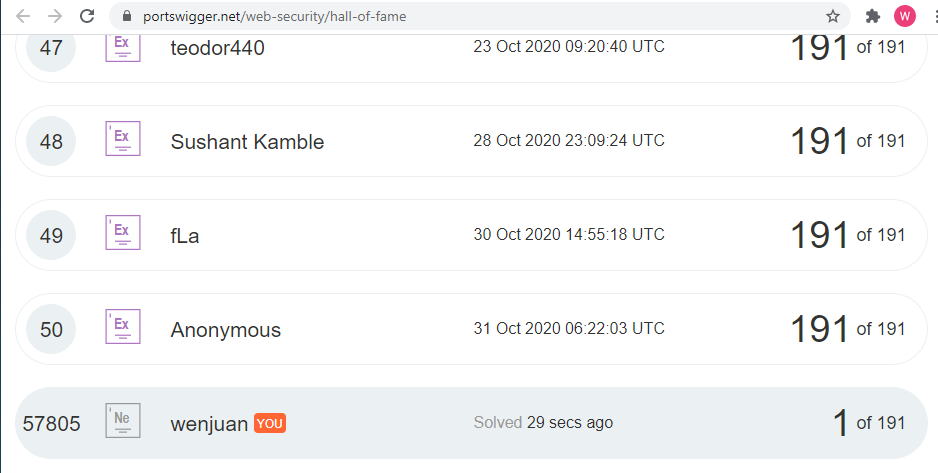

# Cybersecurity-Prework
* Followed [Instructions](https://courses.codepath.org/snippets/cybersecurity_university/prework)
* Software: [Burp Suite Community Edition](https://portswigger.net/burp/communitydownload)
* Academy: [Portswigger](https://portswigger.net/web-security)
* Web Security Academy >> Authentication >> Password-based >> Lab

     * Lab: Username enumeration via different responses

